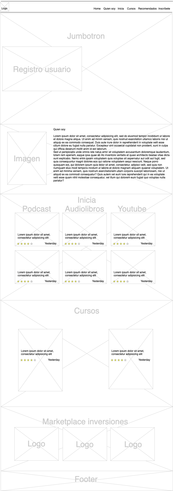

Este es el resumen de lo que se hará para la landingpage.

## **ÍNDICE**

* [1. Desarrollo de prototipado Diagramación](#1-diagramación-de-landinpage)
* [2. Aplicación de HTML semantico estándar](#2-Aplicación-de-HTML-semantico-estándar)
3. [Aplicación de selectores en CSS(#3-Aplicación-de-selectores-en-CSS)
4. [Secciones requeridas](#Secciones-requeridas)
    4.1 Header
    4.2 Jumbotron
    4.3 Footer
5. [Aplicación sección registro de usuario](#Aplicación-sección-registro-de-usuario)
6. [sección catálogo](#6-sección-catálogo)
7. [Uso de Media Queries](#7-uso-de-media-queries)
8. [Uso de repositorio GitHub - 5 "commits"](#8-uso-de-repositorio-github---5-commits)

****

## 1. diagramación de landingpage
La diagramación de la landing page está pensada en los servicios que puede entregar un influencer para poder generar ingresos pasivos, mediante el uso de su conocimiento en contenido gratuito, cursos de pago, marcas y códigos de referidos.

Este es un ejemplo de como se vería

## 2. Aplicación de HTML semantico estándar
## 3. Aplicación de selectores en CSS
## 4. Secciones requeridas
    4.1 Header
    4.2 Jumbotron
    4.3 Footer
## 5. Aplicación sección registro de usuario
## 6. sección catálogo
## 7. Uso de Media Queries
## 8. Uso de repositorio GitHub - 5 "commits"